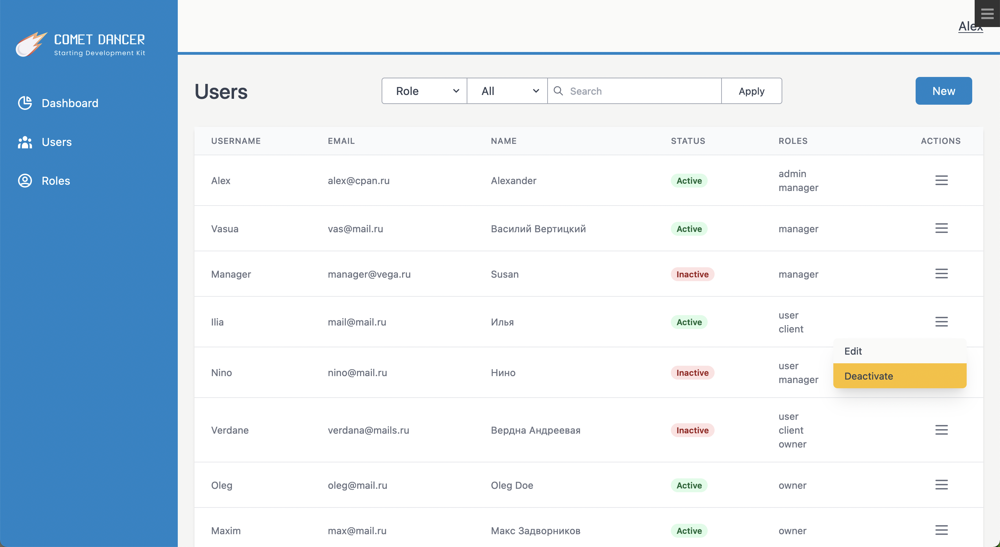
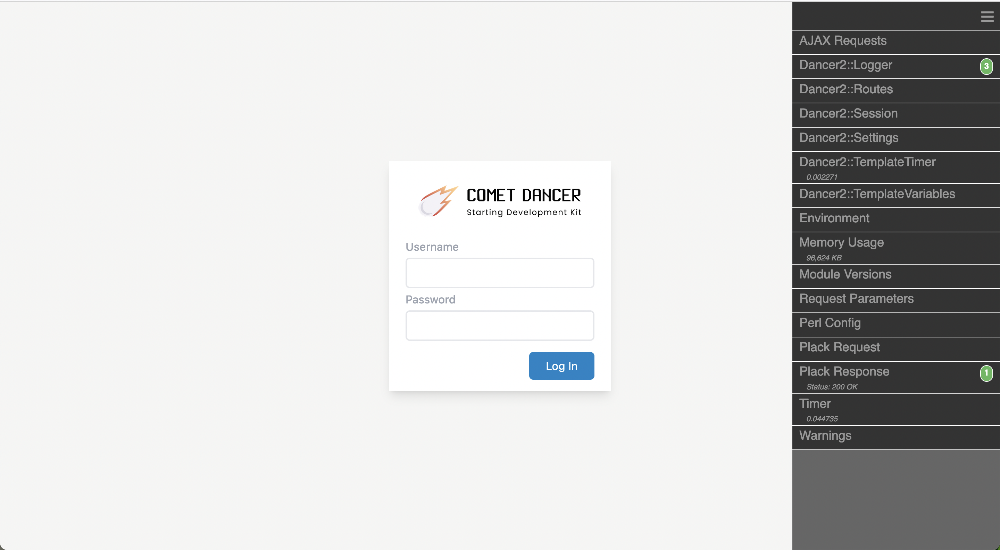
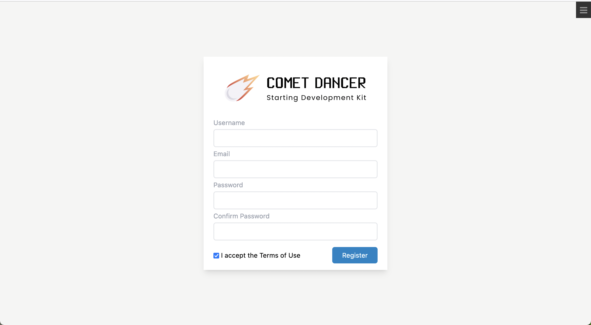
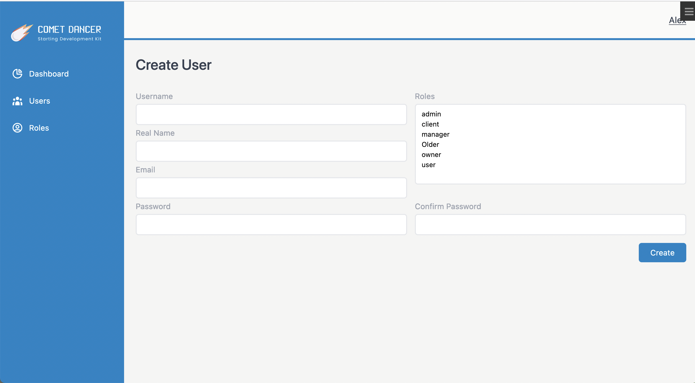

## SYNOPSIS
Ready-to-use foundation for web-application based on Perl5 and Dancer2.

### OUT OF THE BOX:
* docker environment
* dependency management
* database migrations and fixtures
* debugger
* authorization
* user control panel
* csrf protection
* form validation
* css and js build scripts

### SCREENSHOTS

## DESCRIPTION
Comet Dancer it is a set of technologies allows you to quickly start developing a web-app.
It is mainly built on Dancer2(Perl5), and it's ecosystem. But not limited to them.

This is a constantly growing project in which new features will be constantly added.

This project can also be used as an example of Dancer2 big application with separation of controllers, models and views.

### TECHNOLOGIES
* Perl5
* Dancer2
* DBIx::Class
* Docker
* Nginx
* MariaDB
* Redis
* TailwindCSS 3
* AlpineJS 3
* and others...

## USAGE

### PREREQUISITE
* Perl v5.36 with Dotenv module
* Docker

### HOW TO START
1. First fork this repo (couse it's a living project).
2. Then clone it to local machine.
3. Copy .env.example to .env and fill it with your values.
4. Copy ./environments/development.example.yml to ./environments/development.yml and fill it with your values.
5. perl helper.pl up && perl helper.pl logs.
6. perl helper.pl db-migration install && perl helper.pl db-migration populate.
7. perl helper.pl npm-build.

Now you can access you application via localhost. You can login with Alex/pass1234.
Please don't forget to visit localhost/admin.

To stop application: perl helper.pl down.

There are more usefull commands inside helper.pl. You can explore them by your own.

To get acquainted with Comet Dancer, try to implement deleting users.

### CONTRIBUTING
You are welcome! Be concise and respect code style. You can start from TODO list.

### TODO
* Managing the error page through a template
* Media Library
* Journaling
* Local mail sending
* Tests
* Perl critic and Perl tidy
* CLI
* Minion (mojo)
* Medialibrary

### LICENSE AND COPYRIGHT
This software is copyright (c) 2022 by Alexander Panteleev. This is free software; you can redistribute it and/or modify it under the same terms as the Perl 5 programming language system itself.